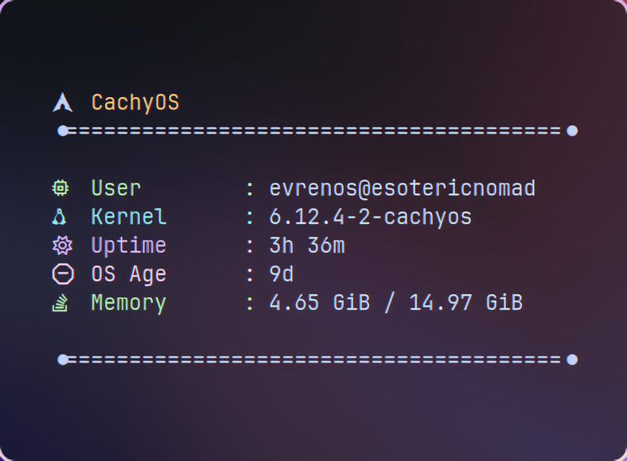

# Rustor

A fast, minimal tool to fetch system info, written in Rust.



---

## Features

- Clean, simple display of system info.
- Blazing fast execution.
- Built with Rust for speed and safety.

---

## Installation

### From Source

1. Clone the repo:

```bash
git clone https://github.com/Evren-os/rustor.git
cd rustor
```

2. Build it:

```bash
cargo build --release
```

3. Install:

```bash
sudo mv ./target/release/rustor /usr/local/bin/
```

### Usage

Just run rustor to see your system info:

```bash
rustor
```

---

## Performance

`rustor` is designed for speed. Benchmarking with [Hyperfine](https://github.com/sharkdp/hyperfine) shows:

```sh
Benchmark 1: rustor
  Time (mean ± σ):     896.3 µs ±  95.5 µs    [User: 330.0 µs, System: 698.2 µs]
  Range (min … max):   661.9 µs … 1159.4 µs    1681 runs
```

This means `rustor` provides system information almost instantaneously.
