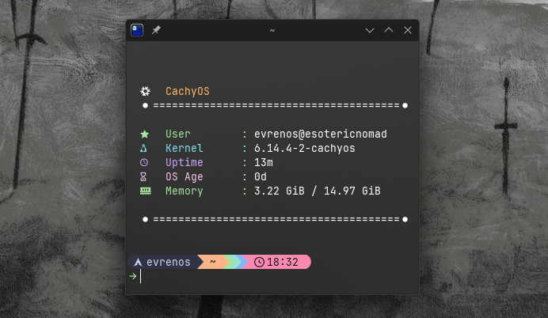

# Rustor

A fast, minimal tool to fetch system info, written in Rust.



---

## Performance

`rustor` is designed for speed. Benchmarking with [Hyperfine](https://github.com/sharkdp/hyperfine) shows:

```sh
Benchmark 1: rustor
  Time (mean ± σ):     799.1 µs ± 113.8 µs    [User: 346.9 µs, System: 592.7 µs]
  Range (min … max):   542.8 µs … 1748.3 µs    1681 runs
```

This means `rustor` takes about 0.0008 seconds (or 0.8 ms) on average to pull system info almost instantly.

---

## Features
- Clean, simple display of system info.
- Blazing fast execution.
- Built with Rust for speed and safety.

---

## Installation

### Via install script

Run this command in terminal:

```bash
curl -fsSL https://raw.githubusercontent.com/Evren-os/rustor/main/install.sh | bash
```

### From source

1. Clone the repo:

```bash
git clone https://github.com/Evren-os/rustor.git
cd rustor
```

2. Build it:

```bash
cargo build --release
```

3. Install:

```bash
sudo mv ./target/release/rustor /usr/local/bin/
```

### Usage

Just run rustor to see your system info:

```bash
rustor
```

---
